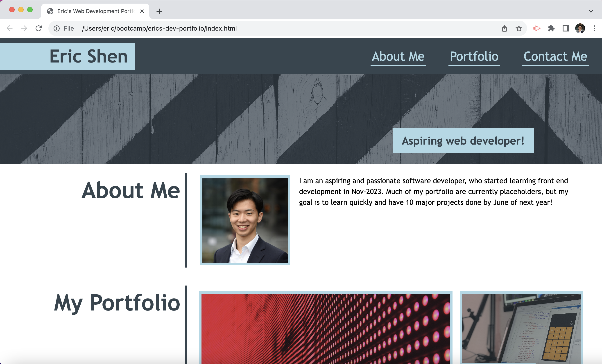

# Eric's Web Development Portfolio

## About the Project

Hello! Welcome to my web design portfolio.

My name is Eric and I am an aspiring web developer. I am currently taking a front end development bootcamp, and hope to create lots of cool applications and tools as I go through the material.

Eventually, I hope to use this portfolio to showcase cool projects I have worked on. Enjoy!

## Getting started

Here's everything you need to know about my portfolio:

### Installation

No installation is required! You can just use your browser to view my portfolio along with any published projects!

### Usage

You should see the following screen when opening the website:

You should be able to access it at this [link](https://kidleis.github.io/erics-dev-portfolio/)

Clicking on project will direct you to the published file (if available), if not available, it will redirect you back to the portfolio.

### Contact me

Feel free to contact me at the following email regarding this website:
eric.shen123@gmail.com

## License

This portfolio is licensed under a GPL-3.0 license. Feel free to use the template (as long as its not for any closed source applications)!

## Acknowledgments

Many thanks to EdX's front end coding bootcamp for supplying the starter HTML and images!

Many thanks to w3 schools for providing useful tidbits on selectors, attributes and even basic javascript:
https://www.w3schools.com/